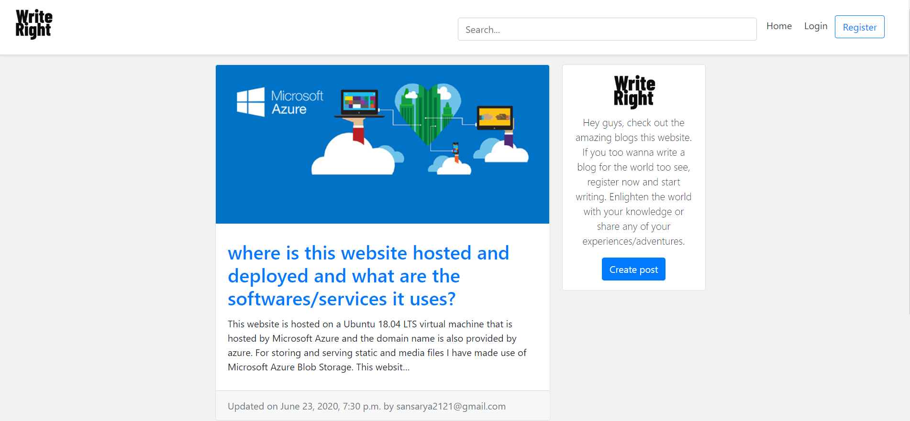
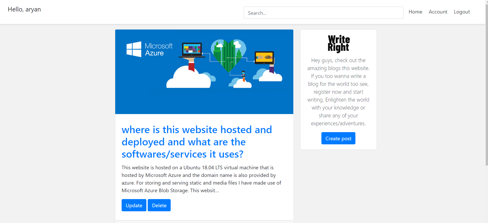
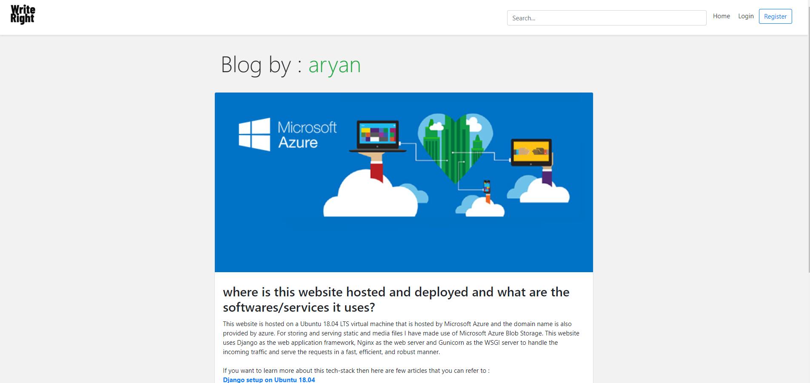
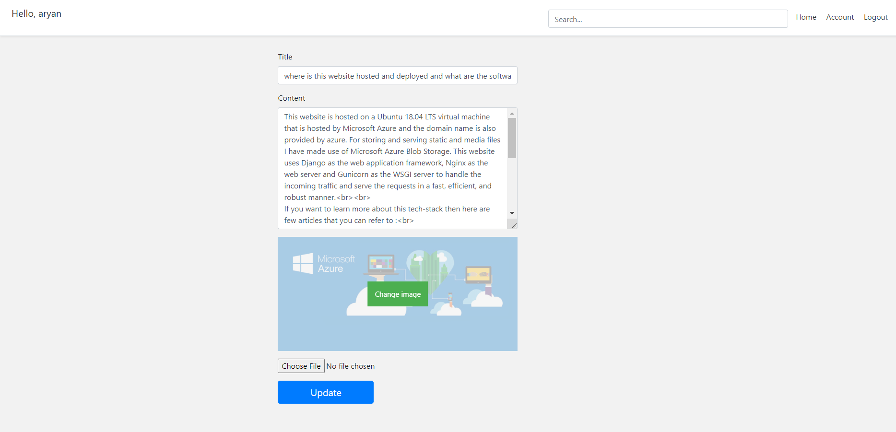
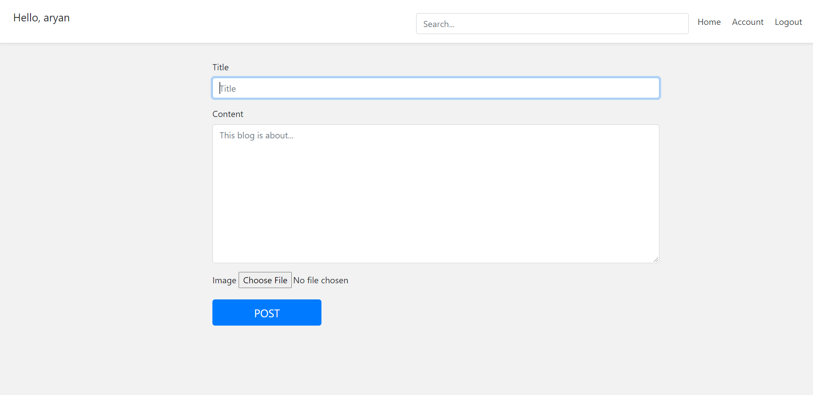
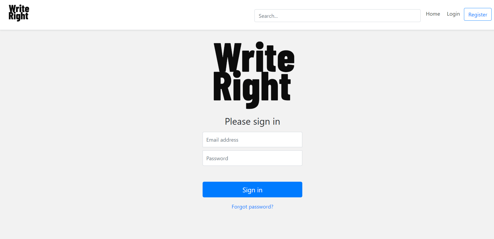
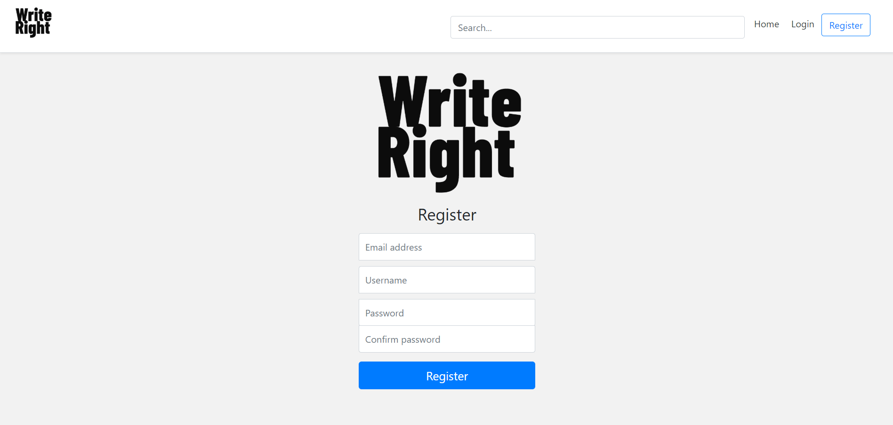
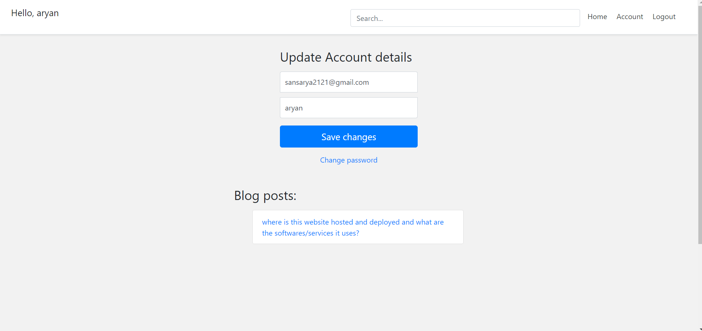

# Write Right
### A blogging website where users can register/login and create/update/delete blogs. Users can check out all blogs by other users too. Every blog must have a title, body/description, and image. This website uses Django as backend with SQL-Lite as the database. For the frontend, uses HTML, CSS, a lot of bootstrap for styling.
<ul>
  <li>
Also have created APIs using Django Rest framework that can interact with this website's backend and change/add
to it. Android app of this website is being made utilizing these APIs.
  </li>
  <li>
Hosted on a Ubuntu 18.04 LTS virtual machine that is maintained by Microsoft Azure. For storing and serving static
and media files I have made use of Azure Blob Storage. Uses Nginx as the web server and Gunicorn as the WSGI
server to handle incoming traffic.
  </li>
</ul>
 <a href="http://writeright.eastus.cloudapp.azure.com/"> Click here to visit </a>

## Some screenshots for illustration :

#### Homepage when user is not logged in :

#### Homepage when user is logged in :

#### Blog detailed view :

#### Blog update view :

#### Create Blog view :

#### login view :

#### Register view :

#### Account update view :

